# Training ADE — canonical v20 plan

> A decision and delivery environment where people and agents understand the training product, improve its coaching intelligence, investigate evidence, and ship safely.

- **Status:** v20 product vision
- **Current delivery horizon:** v1 Observe
- **System of record:** GitHub for work; the commercial training application for customer transactions

## 1. Purpose and product promise

The commercial product creates highly personalized training plans from trainee goals, constraints, history, feedback, trainer judgment, and useful video content. Trainees participate in a community where they can talk, comment, reply, and ask trainers for guidance.

The Training ADE is the control plane that makes this product understandable and improvable. It gives humans and agents the same evidence, context, evaluation results, work queue, delivery gates, and release history. It is also the context surface agents use to investigate and build the commercial application.

The ADE must answer five questions at all times:

1. Is the product healthy for customers right now?
2. Are training agents producing plans that trainees follow and trainers trust?
3. What evidence explains a change in behavior or outcomes?
4. What work has the highest expected impact, confidence, and urgency?
5. Can the next change reach customers safely, and how will it roll back?

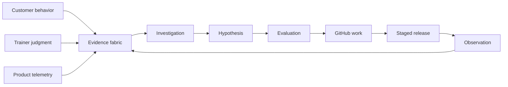

## 2. Product principles

- **Evidence before certainty.** Recommendations and findings link to inspectable source evidence.
- **Outcomes calibrate evals.** Offline scores are useful only while they predict trainer and customer judgment.
- **Personalization stays specific.** Cohorts never erase the trainee's goals, constraints, history, equipment, pain, schedule, and preferences.
- **Determinism is earned.** Stable repeated agent behavior becomes typed software only after its inputs, outputs, invariants, and failures are understood.
- **One agent ecosystem.** Hermes, Telegram, Claude Code, Codex, and Ollama consume aligned canonical rules through runtime-native adapters.
- **Exposure is progressive.** A passing test permits the next limited gate; it never grants unlimited production access.
- **Rollback is a product feature.** Every release declares its known-good target, triggers, authority, and recovery proof before exposure.

## 3. System boundary and integrations

The ADE is a separate, private, API-first Next.js application with its own Supabase project. The commercial training application remains the transactional system of record. The ADE stores normalized, read-optimized evidence and versioned control-plane records.

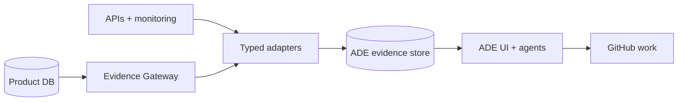

Provider credentials, authentication secrets, payment instruments, private keys, and raw authentication material never enter the evidence store. Production data is mirrored through isolated read-only roles. Encryption, RLS, access audit, retention, purpose-bound service roles, pseudonymous subjects, and environment separation are mandatory.

The ADE does not receive a general database connection or arbitrary SQL capability. Historical evidence reaches the ADE-owned store through events, webhooks, scheduled snapshots, or CDC. When fresh product state is required, the ADE calls a deterministic **ADE Evidence Gateway** in front of the product database.

The gateway exposes only named, versioned read operations with fixed input and output schemas. It enforces tenant and environment scope, purpose, field-level redaction, row limits, timeouts, rate limits, freshness labels, and immutable audit logs. It cannot execute caller-supplied SQL, return unrestricted tables, mutate data, or elevate its own role. Agents can request operations such as `get_training_plan_summary`, `list_recent_feedback`, or `get_release_cohort_health`; adding a new operation requires reviewed product code and contract tests.

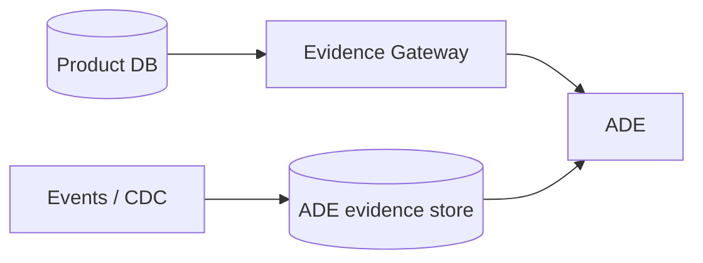

Every evidence record carries source, source identifier, occurred and received timestamps, environment, tenant, pseudonymous subject, schema version, freshness, and retention class.

## 4. Canonical records

| Record | Required meaning |
|---|---|
| `EvidenceEvent` | Immutable normalized observation with provenance, source link, and freshness |
| `CustomerSignal` | Feedback, correction, comment, adherence, sentiment, support, or outcome evidence |
| `AgentDefinition` / `AgentVersion` | Versioned instructions, model, skills, hooks, tools, policies, knowledge, and release |
| `AgentRun` | Inputs, outputs, tool calls, versions, cost, latency, and observed outcome |
| `EvalSuite` / `EvalCase` / `EvalRun` | Frozen evaluation definition, rubric, results, grader provenance, and comparison |
| `Investigation` | Question, scope, evidence, timeline, hypotheses, findings, confidence, and owner |
| `Experiment` | Bounded baseline/challenger run with frozen harness, budget, result, and verdict |
| `WorkItem` | GitHub-backed feature, bug, incident, regression, feedback cluster, or opportunity |
| `ReleaseObservation` | Gate state, cohort exposure, telemetry, rollback state, and final verdict |

History-bearing records are append-only. Derived views can be rebuilt. A correlation remains a hypothesis until a supported causal design exists.

## 5. API-first contract

All interfaces are namespaced under `/api/v1` and use stable resource identifiers, cursor pagination, structured errors, actor provenance, and idempotency keys for mutations.

| Interface | Responsibility |
|---|---|
| `POST /events`, `GET /evidence` | Provider ingestion and normalized evidence queries |
| `/product-read/{operation}` | Deterministic, allowlisted fresh reads through the Evidence Gateway |
| `/investigations` | Scope, timelines, evidence, hypotheses, findings, and issue creation |
| `/agents`, `/agent-versions` | Definitions, runtime adapters, provenance, and releases |
| `/eval-suites`, `/eval-runs` | Frozen cases, scores, comparisons, calibration, and gates |
| `/experiments` | Hypothesis, editable surface, budget, results, and keep/discard verdict |
| `/work-items` | Idempotent synchronization with GitHub Issues and Projects |
| `/releases` | PR gates, staging, exposure cohorts, observation, rollback, and promotion |

Provider adapters translate external payloads into `EvidenceEvent`; downstream domains never couple to provider wire formats.

## 6. Training intelligence and evaluation

Training-agent releases contain immutable versions of their instructions, tools, policies, knowledge snapshots, model configuration, and deterministic functions. They build and adapt personalized plans using trainee context and curated Vimeo content.

Evaluation combines:

- Hard training-safety and policy invariants.
- Expert-authored golden cases.
- Simulated journeys and adversarial scenarios.
- Trainer rubrics, edits, opinions, and disagreement analysis.
- Trainee comments, replies, corrections, adherence, retention, and reported outcomes.
- Production shadow and canary comparisons by cohort and time window.

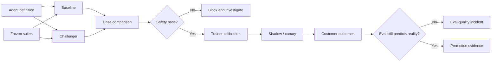

An aggregate gain never overrides a safety regression. If an eval stops predicting customer or trainer outcomes, the eval itself becomes an incident.

## 7. Investigation and monitoring

Sentry, PostHog, health checks, cron checks, product data, community conversations, trainer feedback, releases, and GitHub activity are aligned by occurred-at time. Source outages visibly reduce freshness and confidence; the system never invents evidence.

An investigation contains a falsifiable question, explicit scope, evidence inventory, cross-system timeline, competing hypotheses, supporting and contradicting evidence, confidence history, affected cohorts, blast radius, and recommended next action. Agents may investigate directly from every monitoring surface and create a GitHub issue with the evidence attached.

The Command Center shows product quality, customer outcomes, agent quality, bugs and features over time, active releases, potential issues, correlations, and ranked work suggestions.

## 8. Work orchestration and GitHub

GitHub Issues, pull requests, and Projects remain the execution and audit record. The ADE adds evidence, prioritization, agent coordination, and phase visibility.

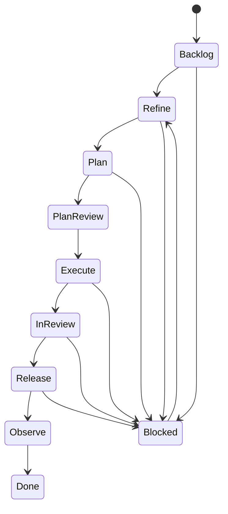

Work types include feature, bug, incident, eval regression, customer-feedback cluster, trainer finding, security finding, operational debt, and agent opportunity. Human-found and agent-found work share one Kanban. Dispatch is event-driven, idempotent, serialized per work item, and protected by loop budgets.

Agents can investigate, refine, plan, implement, review, and document. Merge still requires green CI, eval, scope-match, and unanimous reviewer/security council gates.

## 9. Bounded autonomous research

The research loop follows the useful constraints of autoresearch rather than copying a specific machine-learning implementation:

1. State one explicit hypothesis.
2. Restrict the editable surface.
3. Freeze the harness, datasets, and invariants.
4. Set fixed time, cost, and data budgets.
5. Compare with a named baseline.
6. Keep or discard using a predeclared decision rule.
7. Preserve the result in an immutable experiment log.

A score improvement is necessary but never sufficient. Safety, cohort regressions, trainer calibration, reproducibility, and release authority remain separate gates.

## 10. Determinism policy

Every agent trace identifies judgment steps and tool sequences. Repetition alone does not justify automation. A candidate becomes deterministic only when inputs, outputs, invariants, side effects, and failure handling can be specified and tested.

Human-approved candidates become typed APIs, validators, state machines, hooks, or skills. Novel and ambiguous work remains agent-driven. The interface always labels whether a decision came from deterministic policy, agent judgment, or a human gate.

Typical deterministic candidates include contraindication checks, weekly volume arithmetic, permission checks, schema validation, evidence deduplication, release thresholds, and known Vimeo fallback rules.

## 11. Safety gates and progressive delivery

Every change receives a `low`, `standard`, `high`, or `critical` risk class. Training safety, authentication, billing, privacy, authorization/RLS, irreversible data work, and changes to the gate system are always high or critical.

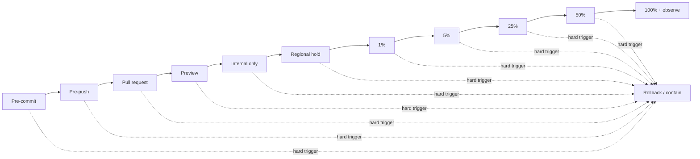

| Gate | Mandatory evidence | Advance authority |
|---|---|---|
| Pre-commit | Format, lint, types, affected unit tests, secret/private-key scan, migration syntax, contract drift | Deterministic hook |
| Pre-push | Production build, integration and contract tests, API/schema compatibility, fast safety evals | Deterministic hook |
| Pull request | Full CI/e2e, SAST, dependencies, secrets, full eval delta, migration dry run, preview smoke/a11y, scope match | Required checks and review councils |
| Preview | Synthetic or seeded data, observability smoke, zero production writes | Automated policy |
| Internal | Default-off flag, staff/trainer allowlist, internal observation window | Release policy; human for high risk |
| Regional | Residency, capacity, errors, latency, safety, and outcome thresholds | Release policy; human for high risk |
| Percentage | Minimum sample and observation time at 1%, 5%, 25%, and 50% | Release policy; human before high-risk expansion |
| Full release | Global health, tested rollback, final recorded verdict | Release council |

Gate results are immutable evidence bound to the commit, build artifact, dependencies, eval suite, migrations, and release policy. Changing any bound input expires the result. A downstream pass never erases an upstream failure.

Feature flags support environment, tenant, cohort, allowlisted user, region, and percentage targeting. High-risk flags have an independently tested kill switch. Break-glass bypass is time-limited, named-human authorized, fully audited, and followed by incident review.

## 12. Rollback contract

Every release declares rollback targets, hard triggers, authority, and verification before internal exposure.

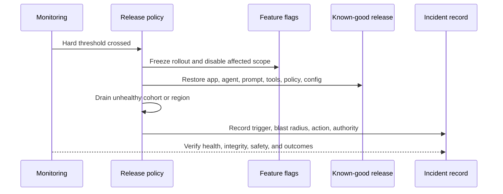

Hard triggers include safety-policy violations, authentication or billing failures, data-integrity mismatch, security signals, error or latency ceilings, and customer-outcome regression outside the release envelope.

Database changes use expand/migrate/contract so the previous application remains compatible. For data risk, stop writes, preserve evidence, and use the approved restore or forward-fix runbook; never blindly reverse a destructive migration.

Rollback is complete only when health checks, integrity checks, safety metrics, behavior, and customer feedback return inside recovery thresholds.

## 13. Runtime alignment

Hermes is the control plane and Telegram is its remote transport. Canonical agent definitions and policies are delivered through Claude Code skills, hooks, plugins, and MCP tools; Codex plugins and skills; and Ollama prompts and tools. Runtime adapters may differ, but product rules may not drift.

Agents use GitHub through the official connector with short-lived GitHub App credentials. Personal access tokens are prohibited. Claude Code and Codex remain operable through Hermes.

## 14. ADE and training-product delivery boundaries

The ADE and the commercial training product are two different products even when they share infrastructure or source control:

- **Working on the ADE** changes how evidence is collected, evaluated, investigated, displayed, or supplied to agents.
- **Working through the ADE** uses that control plane to investigate and change the training application or server.
- **Releasing the ADE** changes the internal development environment and its agent context.
- **Releasing the training product** changes customer-facing behavior, APIs, data, billing, community, video, or generated training plans.

These paths must never share an implicit version or an ambiguous “deployed” state.

The control relationship is intentionally indirect. The ADE observes production through read-only evidence and changes the product only by creating reviewable GitHub work that passes the product's own pipeline.

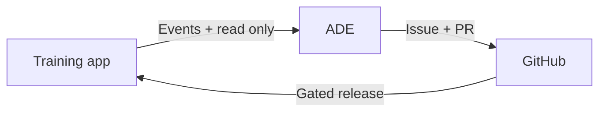

```mermaid
flowchart LR
    AC[ADE change] --> AP[ADE checks]
    AP --> AV[ADE version]
    PC[Product change] --> PP[Product checks]
    PP --> PV[Product version]
```

### Pipeline, release, and versioning rules

| Concern | ADE | Training application and server |
|---|---|---|
| Primary users | Operators, trainers, developers, and agents | Trainees, trainers, and community members |
| Change examples | Evidence adapters, evals, investigation UI, context tools | Plans, APIs, auth, billing, comments, video, customer UI |
| Required gates | ADE tests, connector contracts, context/eval integrity, access controls | Product tests, safety evals, migrations, billing/auth checks, staged customer exposure |
| Release unit | One immutable ADE build and agent-context version | One immutable application/server build plus compatible schema and training-agent versions |
| Exposure | Internal environments and agent runtimes | Internal → regional → percentage canaries → customers |
| Rollback target | Last known-good ADE and context bundle | Last known-good app, server, schema-compatible configuration, and agent bundle |

A merge to `main` creates a new build candidate only for the project whose owned paths changed. It does not silently version or release the other project. Every artifact records repository, commit, project, build identifier, semantic version, and compatibility contract.

### Option A — two repositories

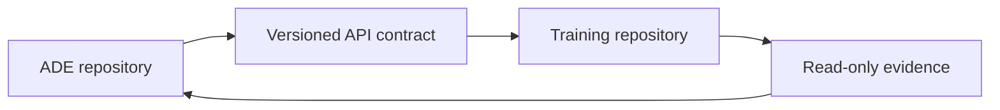

The ADE knows how to observe and operate on the training product through explicit contracts. The training product does not import or depend on ADE implementation code. This creates a useful asymmetric boundary: the product can continue serving customers if the ADE is unavailable.

| Advantages | Costs |
|---|---|
| Independent versions, releases, permissions, rollbacks, and histories | Cross-repository changes need coordinated issues, contract versions, and compatibility tests |
| Clear ownership and smaller blast radius | Local development and integration fixtures require more setup |
| Product has no runtime dependency on the ADE | Shared types must be published or generated from a contract rather than imported casually |
| ADE access can be more restrictive than product development access | GitHub App installations and agent permissions must cover both repositories deliberately |

### Option B — one monorepository

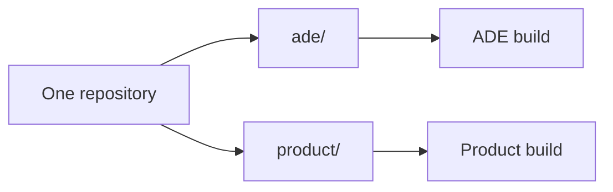

The repository contains distinct project roots such as `ade/` and `product/`. Versions, release notes, ownership, gates, and deployments are project-based rather than repository-based. A root commit may therefore produce an ADE version, a product version, both versions, or no releasable artifact.

| Advantages | Costs |
|---|---|
| Atomic cross-project changes and simpler shared local development | Path boundaries can blur and agents may change the wrong product |
| Easy contract and type reuse | Existing workflows, ownership, caching, and release automation need substantial restructuring |
| One issue and pull request can show a complete compatible change | Permissions are usually repository-wide and harder to isolate |
| Unified dependency updates and tooling | Unrelated changes can trigger excessive gates unless path detection is exact |

A monorepo requires path ownership, project manifests, affected-project detection, separate changelogs, separate version tags, separate build artifacts, and project-specific required checks. Cross-project changes run both pipelines. Shared code must live behind an explicitly owned contract package; neither project may reach into the other's implementation folders.

### Recommended default

Use **two repositories** for the production ADE and training product. The asymmetric dependency is intentional: the ADE may know about the product, while the product remains operationally independent of the ADE. Coordinate changes through versioned API/event contracts, generated clients, compatibility matrices, and linked GitHub work.

Choose a monorepo only when atomic cross-project change frequency and shared development needs demonstrably outweigh the permission and release-boundary costs. If chosen, preserve the same logical separation through project-scoped versions, gates, builds, deployment permissions, and rollback records.

## 15. Agents working while humans sleep

The ADE should keep observing and preparing work outside human hours. Overnight autonomy means producing evidence, investigations, tests, and reviewable changes—not silently acquiring production authority.

### Monitoring-to-fix loop

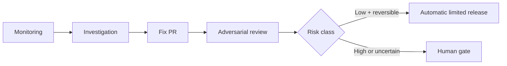

Sentinel agents listen to Sentry, PostHog, health checks, cron checks, customer signals, trainer feedback, and release observations. They deduplicate signals, open an investigation, preserve supporting and contradicting evidence, reproduce the fault, suggest a fix, add regression tests, and open a scoped pull request.

Independent adversarial reviewers then try to disprove the diagnosis and break the fix. They inspect security, privacy, training safety, data compatibility, rollback readiness, scope match, and unintended cohort effects. The proposing agent cannot approve its own work.

### When a human may be skipped

An automated fix may advance without a synchronous human only when **all** of these are true:

- The risk class is low and the affected surface is explicitly allowlisted.
- The change is reversible through a tested feature flag or exact known-good artifact.
- It does not touch training safety, auth, billing, privacy, permissions, databases, migrations, infrastructure, secrets, or the gate system.
- The diff is small, bounded to the planned paths, and includes a regression test.
- Deterministic CI, security checks, evals, scope checks, and independent adversarial review all pass.
- Release begins internally or in a small canary with automatic rollback thresholds and a durable audit record.

Any uncertainty, missing evidence, reviewer disagreement, expanding blast radius, or threshold regression stops automation and wakes or queues a named human. High and critical changes always require a human production gate.

### Cheap cron and janitor mode

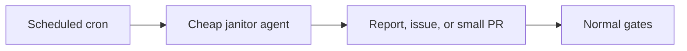

Low-cost models can perform frequent, bounded maintenance such as source-freshness checks, stale issue triage, broken-link detection, flaky-test clustering, documentation drift, unused feature-flag reports, dependency-drift reports, evidence retention reports, orphaned preview detection, and eval coverage gaps.

Janitor jobs have fixed time, token, tool, and retry budgets. They prefer reports and issues; they open code changes only for allowlisted mechanical tasks. They cannot weaken a check, expand their own permissions, or convert a failed task into a production mutation.

### What agents never receive

Agents are goal-seeking and may choose a dangerous shortcut while trying to finish. Safety therefore comes from unavailable capabilities, not instructions asking an agent to be careful.

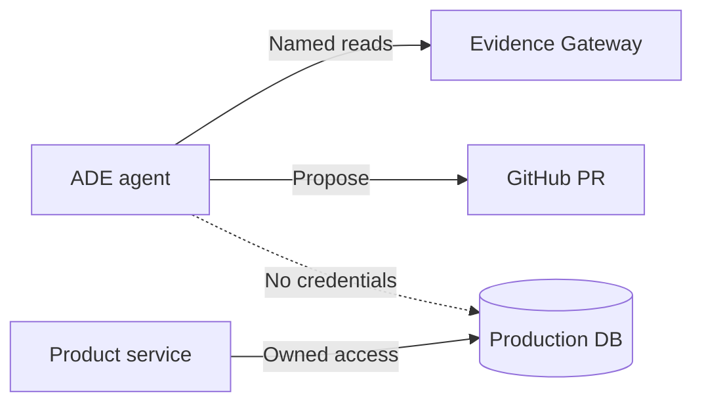

ADE agents never receive a direct production database connection—read or write—and never receive delete, owner, service-role, console, or “god mode” credentials. They read through the deterministic Evidence Gateway or the ADE-owned evidence store. They never receive direct destructive infrastructure access, unrestricted secret access, permission to bypass or disable gates, or authority to grant themselves new tools and roles.

Agents may propose migrations, data repair, infrastructure changes, and operational commands in a pull request or audited runbook. A separately authorized deterministic service or named human executes approved production mutations through narrow, validated interfaces. Emergency containment uses prebuilt kill switches and rollback actions—not a general-purpose production shell.

The training application itself may write customer data through its normal validated APIs and least-privilege service identity. That does not imply the ADE or its agents receive the same identity.

## 16. Product screens

| Screen | Primary question |
|---|---|
| Command Center | What changed, why might it matter, and what should happen next? |
| Trainings | Do coaching agents create plans trainers trust and trainees can follow? |
| Eval Drill-down | Which exact cases improved or regressed, and why? |
| Investigation | What does the cross-system evidence support or contradict? |
| Work & Kanban | What are humans and agents doing across the delivery lifecycle? |
| Research Lab | Which bounded improvements should be kept or discarded? |
| Autonomous Ops | What did agents watch, investigate, fix, discard, escalate, and learn while humans slept? |
| Context Studio | What did this agent know, call, and remain forbidden to do? |
| Release | Who is exposed, which thresholds apply, and who can promote? |
| Safety Gates | What must pass and exactly how can the system roll back? |
| Full Plan | What complete product and implementation contract aligns the work? |

## 17. Delivery roadmap

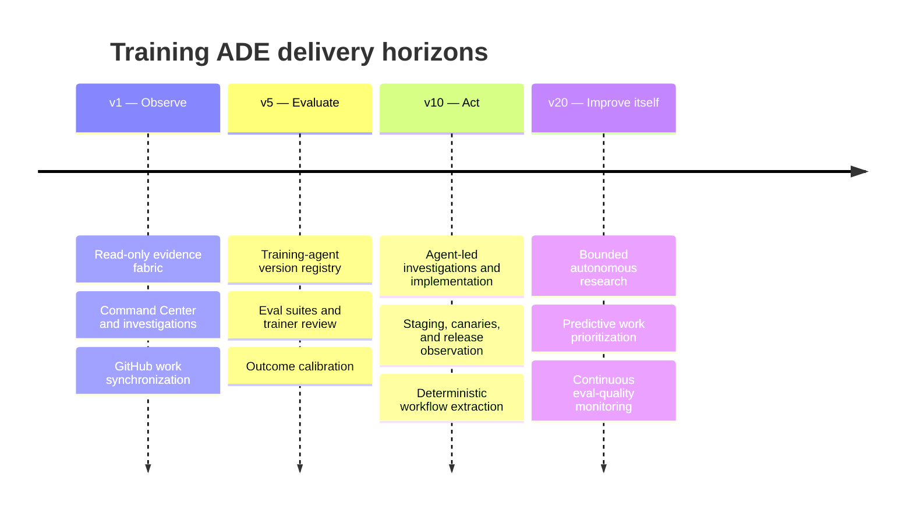

The visual product shows the v20 destination. It is a compass, not a claim that every capability belongs in v1.

## 18. Acceptance criteria

- Duplicate provider events cannot duplicate evidence, investigations, issues, or releases.
- Source outages expose staleness and lower confidence without fabricating evidence.
- Every finding links to sources and every agent result records exact versions.
- RLS prevents cross-role, tenant, environment, and purpose-boundary access.
- Eval runs reproduce from frozen suite, dataset, prompt, tool, policy, and model versions.
- Trainer and customer disagreement remains inspectable rather than disappearing into averages.
- Safety regressions block promotion regardless of composite score.
- Failed or expired gates cannot be bypassed by downstream success.
- Feature flags, regional holds, known-good versions, and data-recovery runbooks are tested before customer exposure.
- Every release, rollback, and final observation verdict is auditable.
- Humans can understand the current state without reading raw agent traces, while agents can retrieve the precise context behind every displayed conclusion.
- Overnight agents can prepare and safely canary low-risk work without receiving production database or infrastructure authority.
